# quantizeeffinet

[](https://www.python.org/downloads/)
[](https://tensorflow.org/)
[](https://developer.nvidia.com/tensorrt)

A Python package for seamlessly converting Efficientnet TensorFlow models to ONNX and TensorRT formats, enabling optimized inference on NVIDIA GPUs.

## Features

- **TensorFlow to ONNX Conversion**: Convert SavedModel or model weights to ONNX format with FP32 or FP16 precision
- **ONNX to TensorRT Conversion**: Build optimized TensorRT engines with dynamic batch sizes
- **Direct TF to TRT Pipeline**: One-step conversion from TensorFlow to TensorRT
- **INT8 Quantization Support**: Improve inference speed with INT8 calibration
- **Comprehensive Logging**: Detailed conversion process tracking and validation

## Table of Contents

- [Installation](#installation)
  - [Prerequisites](#prerequisites)
  - [Install from Wheel File](#install-from-wheel-file)
- [Quick Start](#quick-start)
- [Usage Examples](#usage-examples)
  - [ModelConverter](#model-converter)
  - [Keep In Mind](#keep-in-mind)
  - [TensorFlow to ONNX](#tf_to_onnx)
  - [ONNX to TensorRT](#onnx_to_trt)
  - [TensorFlow to TensorRT](#tf_to_trt)


## Installation

### Prerequisites

Before installing the package, ensure you have the following:

- **Python 3.8 or higher** - Check with `python --version`
- **pip** (Python package manager) - Check with `pip --version`
- **NVIDIA GPU** with CUDA support
- **CUDA Toolkit 11.7+** - [Download from NVIDIA](https://developer.nvidia.com/cuda-downloads)
- **TensorRT 8.5+** - [Download from NVIDIA](https://developer.nvidia.com/tensorrt)

### Install from Wheel File

1. **Download the wheel file** provided to you
2. **Open a terminal** and navigate to the directory containing the .whl file.
3. **Install the package** using pip.
4. **If dependencies are not automatically installed** with the wheel file, you can install them using the provided `requirements.txt` file:


## Quick Start

1. Install the wheel and dependencies, then import the converter: `from quantizeeffinet import ModelConverter`
2. Create a converter instance: `converter = ModelConverter()`
3. Convert TensorFlow to ONNX or straight to TensorRT, with optional FP16/INT8 settings and dynamic batching.



## Usage Examples

### ModelConverter

ModelConverter provides three utilities: convert TensorFlow models to ONNX, 
build TensorRT engines from ONNX, and run a one-call
TensorFlow to TensorRT pipeline for deployment-ready inference engines. 
These three utilities are accessed by three functions.


### Keep In Mind

- The original input shape (NHWC) will be changed to (NCHW)
- All the functions' `output_model_path` could be `None` this way the functions return the created models. However, it is not recommended to use these models for inference right away. The best practice is to restart the Python kernel, thus freeing up all allocated memory. After that, with a new run, you could run inference without any errors.
- Fp16 TensorRT engines are the bes choice for now, as they provide the fastes inference wihout any accuracy loss.

### tf_to_onnx

- Converts a `tf.keras` SavedModel or a `.h5` Weights file to an ONNX model.
- I you pass a `.h5` file that only contains weights, you should also specify the base model, like EfficientNetB3, B5, B6
- The keras model input shape must be `(None, 224, 224, 3)`.
- Supports exporting to FP32 or FP16 ONNX graph.
- You do not have to change opset argument in the function call `opset=13` is sufficient.

```
from quantizeeffinet import ModelConverter

converter = ModelConverter()
onnx_model = converter.tf_to_onnx(
    input_model="path/to/efficientnet_b3.h5",
    output_path="path/to/output/model.onnx",
    precision="fp16",                      
    only_weigths_of_model='EfficientNetB3'
)
```

### onnx_to_trt

- Parses an ONNX model and builds a TensorRT engine.
- The input model could be passed as a path to a `model.onnx` file or as a `onnx.ModelProto` object.
- The onnx model input shape must be `(-1, 3, 224, 224)`.
- If no path to save the engine and `auto_generate_engine_path=True` it auto-generates the path.
- Supports exporting to FP32, FP16 or Int8 trt engines.
- TensorRT uses dynamic batching. This means that you have to specify 3 arguments:
  - `min_batch: int = 1`, this is the minimum nuber of images that a batch could ever contain *(Should stay 1)*.
  - `opt_batch: int = 32`, this is the number of images that most of the inference batches will contain *(Should be the same as max_batch)*.
  - `max_batch: int = 32`, this is the maximum nuber of images that a batch could ever contain *(Should be the same as max_batch)*.


```
from quantizeeffinet import ModelConverter

converter = ModelConverter()
engine = converter.onnx_to_trt(
    input_model="path/to/model.onnx",
    engine_file_path="path/to/output/model.engine",
    precision="fp16",                   
    min_batch=1,
    opt_batch=16,
    max_batch=32
)
```

- INT8 requires a calibration step or an existing cache.
- INT8 mode supports using a directory of images, a single image, a list of images, or an existing calibration cache to avoid recalibration.
- If no cache value is given then images are going to be used and no cache will be saved, if no images are given then cache value will be used. If both are pased to the function then the cache will be used for faster conversion.

```
from quantizeeffinet import ModelConverter

converter = ModelConverter()
model=converter.onnx_to_trt(
    input_model=path/to/model.onnx,
    engine_file_path=path/to/int8_efficientnet.engine,
    min_batch=1,
    max_batch=32,
    opt_batch=32,
    precision="int8",
    calibration_images=path/to/calibration/images/dir,
    calibration_cache=path/to/calibration.cache,
)
```


### tf_to_trt

Runs the end-to-end pipeline in one call. Exports a TensorFlow model to ONNX, then builds a 
TensorRT engine with the selected precision and batch profiles, 
streamlining deployment. 
- If you pass a `.h5` file that only contains weights, you should also specify the base model, like EfficientNetB3, B5, B6
- When using INT8, provide calibration images or a calibration cache.

```
from quantizeeffinet import ModelConverter

converter = ModelConverter()
model=converter.tf_to_trt(
    input_model="path/to/efficientnet_b3.h5",
    engine_file_path=path/to/int8_efficientnet.engine,
    only_weigths_of_model='EfficientNetB3',
    min_batch=1,
    opt_batch=32,
    max_batch=32,
    precision="int8",
    calibration_images=path/to/calibration/images/dir,
    calibration_cache=path/to/calibration.cache,
)
```
